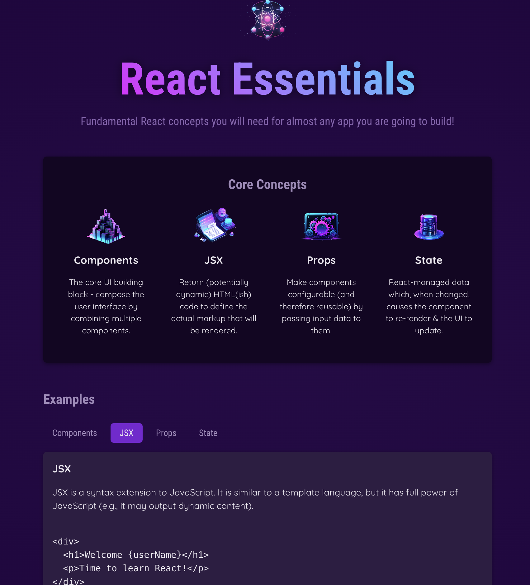

# App Overview

This app shows brief description of each core concept of React. It also allows user to see example of each core concept by clicking the tab menu in the example section.

- Live site: https://react-refresh-d0eda.web.app

React Core Concepts include:

1. Components
2. JSX
3. Props
4. State

## User Story

- React developer can always briefly review each core concept of React with its corresponding example listed under the tab menu in the example section.

## Technologies Used

- React
- JavaScript
- HTML 5
- CSS

Note: I coded along while following React course by Academind @ https://github.com/academind
